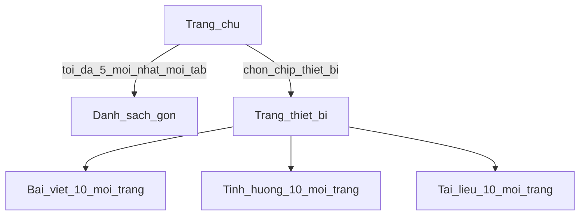

# Kế hoạch UX Fix1 — gỡ trùng menu, import nội dung, trang chủ gọn + phân trang theo thiết bị

## 1. Bỏ nút trùng trên Trang chủ

**Vấn đề:** `+ Bài viết`, `+ Tình huống`, `+ Upload` đang hiện **2 lần** (menu cố định trên header + cụm nút cạnh tiêu đề “Trang chủ”).

**Cách làm:**
- Giữ **chỉ trên header** (cố định mọi trang) — đúng như bạn muốn.
- Xóa cụm 3 nút bên phải tiêu đề trên [`src/app/page.tsx`](src/app/page.tsx).
- Trang chủ chỉ còn: tiêu đề / mô tả ngắn + bộ lọc thiết bị + danh sách xem (không còn nút thêm ở đây).

---

## 2. Form thêm/sửa bài viết: upload `.md` / `.docx` đổ vào ô Nội dung

**Mục tiêu:** Không copy-paste tài liệu dài hàng nghìn trang; upload file → chữ tự vào ô Markdown → xem/sửa nhẹ → **Lưu bài viết** → về Trang chủ.

### Luồng UI (trang `/articles/new` và `/articles/[id]/edit`)

1. Form giữ các trường: Tiêu đề, Loại thiết bị, Tags, **Nội dung (Markdown)**.
2. Thêm khối **“Nhập từ file”** cạnh ô Nội dung:
   - Chọn file `.md` / `.docx` (và `.txt` nếu cần).
   - Nút **Đổ vào nội dung** (hoặc “Cập nhật nội dung từ file”).
3. Sau khi bấm: hệ thống **trích text** (md đọc thẳng; docx qua mammoth — đã có sẵn trong project) → ghi vào textarea Nội dung (có thể **nối thêm** hoặc **thay toàn bộ** — mặc định đề xuất: **thay toàn bộ** kèm confirm nếu ô đã có chữ).
4. Người dùng xem/chỉnh nhẹ trong ô (vẫn là text trên web).
5. Nút **Lưu bài viết** → lưu DB như hiện tại → **redirect về Trang chủ `/`**.

### Kỹ thuật

- API nhỏ (vd. `POST /api/articles/import-text`) hoặc xử lý client+server action: nhận file → trả `{ text }` → form đổ vào state/textarea (component client cho phần nội dung).
- **Không** bắt buộc lưu file vào `data/knowledge/` ở bước này (trừ khi bạn muốn đồng thời lưu bản gốc — phase sau). Phase này ưu tiên: **text vào bài viết**.
- Cảnh báo nếu file quá lớn (vd. > vài MB / text quá dài): cắt hoặc báo “nên tách chương”.

### Phạm vi

- **Bắt buộc trong plan này:** form **Bài viết**.
- **Tình huống:** áp dụng tương tự cho từng ô dài (Triệu chứng / Cách xử lý…) hoặc một nút “đổ vào ô đang focus” — làm cùng kiểu nếu thời gian cho phép; nếu không thì phase ngay sau bài viết.

---

## 3. Trang chủ chỉ 5 mục mới nhất; theo thiết bị = list đầy đủ + phân trang

### Trang chủ `/`

- Sau khi bỏ nút trùng: còn lọc thiết bị (chips) + tab Bài viết / Tình huống / Tài liệu.
- **Mỗi tab chỉ hiển thị tối đa 5 mục mới nhất** (theo `updatedAt` / `createdAt` giảm dần).
- Không phân trang trên trang chủ — mục đích “tiêu biểu, đỡ rối”.
- Có dòng chữ kiểu: *“Hiển thị 5 mục mới nhất. Xem đủ theo từng thiết bị bên dưới / chọn thiết bị.”*
- Click chip thiết bị → vào trang thiết bị (không nhồi full list dài trên trang chủ).

### Trang theo thiết bị `/equipment/[slug]`

- Show **3 khối** (hoặc 3 tab): Bài viết | Tình huống | Tài liệu (upload).
- Trong mỗi khối: **mới nhất lên trên**.
- **Phân trang:** mỗi loại tối đa **10 mục / trang**; có nút Trước / Sau (hoặc số trang) khi vượt 10.
- Query dạng `?section=articles&page=2` (hoặc `tab` + `page`) để bookmark/share được.

---

## 4. Thứ tự triển khai (khi bạn duyệt)

1. Xóa nút trùng trên Trang chủ; chỉnh copy “5 mục mới nhất”.
2. Trang chủ: limit 5 / tab; chip thiết bị dẫn `/equipment/[slug]`.
3. Trang thiết bị: 3 list + phân trang 10.
4. Form bài viết: upload md/docx → đổ nội dung → Lưu về Trang chủ.
5. (Tuỳ chọn cùng PR) Form tình huống: import text tương tự.

## Tiêu chí xong

- Menu trên header là **nơi duy nhất** có + Bài viết / + Tình huống / + Upload.
- Trang chủ không dài vô hạn — tối đa 5/tab.
- Vào từng thiết bị xem đủ, mới nhất trước, sang trang khi > 10.
- Viết bài dài: upload file → nội dung tự vào ô → Lưu → về Trang chủ.
